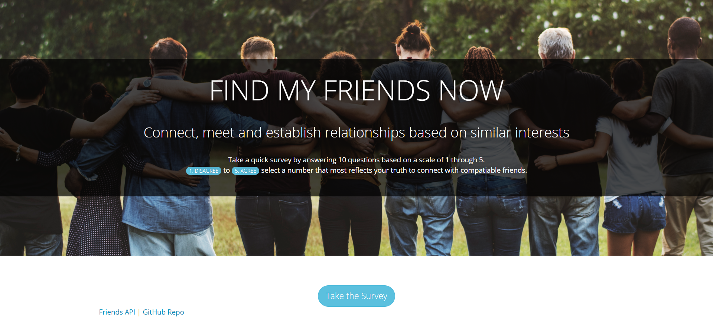
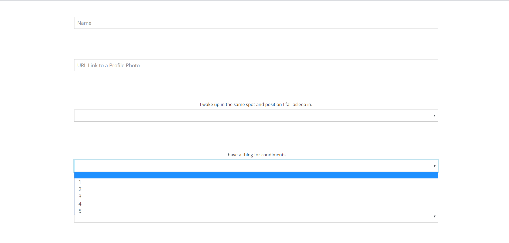

# Find-My-Friends-Now
### Overview
Friend-finder is a compatibility-based application -- basically a dating app. This full-stack site will take in results from your users' surveys, then compare their answers with those from other users. The app will then display the name and picture of the user with the best overall match.

Applications Used:
- [x] Express
- [x] Heroku

### Find-My-Friends-Now App: https://find-my-friends-now.herokuapp.com/

**Find-My-Friends-Now will take in a specific command and render results based on the specified command.**
- input name
- input profile photo url
- 10 survey questions based on a scale of 1-5

### Find-My-Friend-Now | *Home* |

--------------------------------------------------------------------------------------------------------------------------------------

#### STEP 1: `USER` NAME & PROFILE PIC URL 

--------------------------------------------------------------------------------------------------------------------------------------

#### STEP 2: `SURVEY` 10 QUESTIONS 

--------------------------------------------------------------------------------------------------------------------------------------
